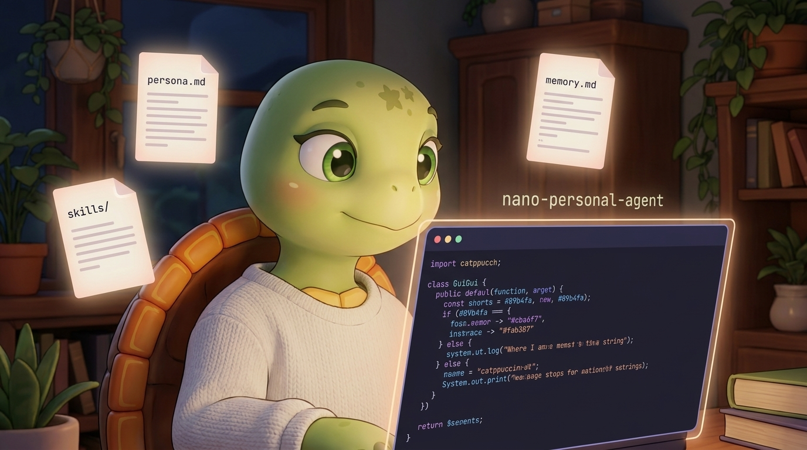
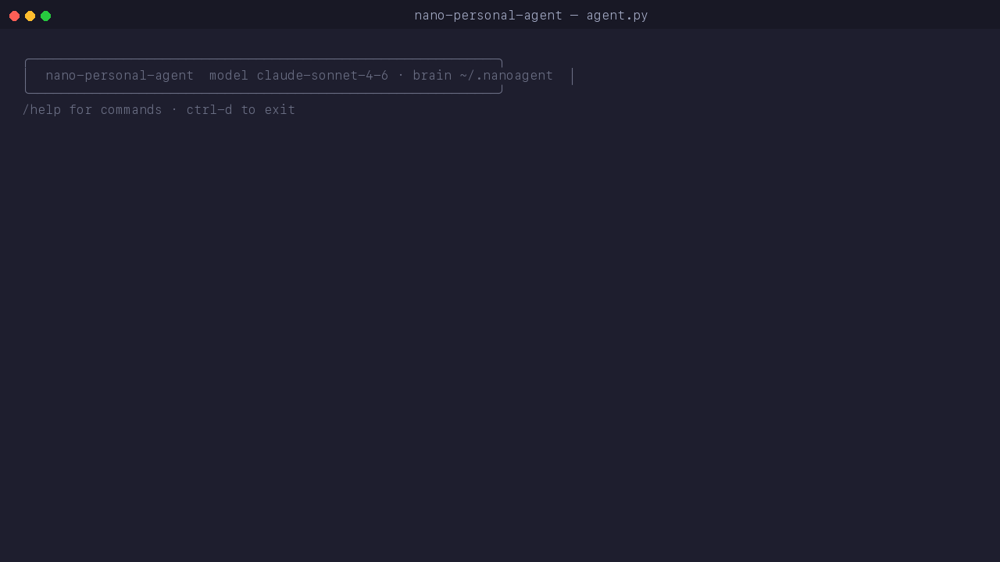
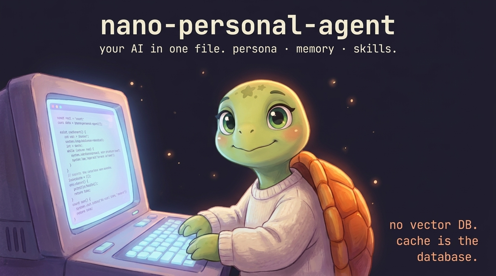
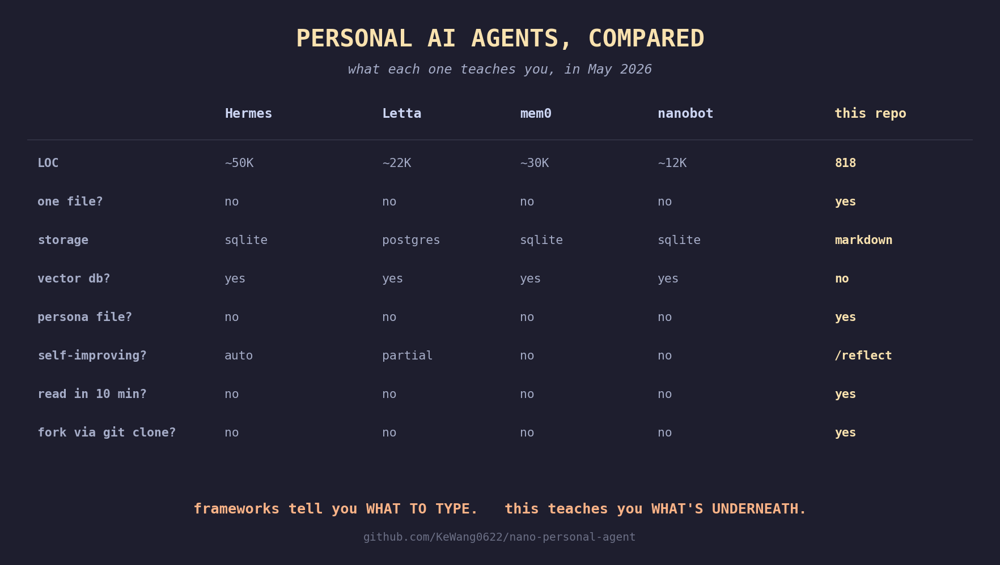

# nano-personal-agent

<p align="center">
  
</p>

<p align="center">
  <a href="https://github.com/KeWang0622/nano-personal-agent/actions"></a>
  <a href="https://github.com/KeWang0622/nano-personal-agent/blob/main/LICENSE"></a>
  <a href="https://www.python.org/"></a>
  <a href="https://github.com/KeWang0622/nano-personal-agent/stargazers"></a>
</p>

**A personal AI agent in one Python file.** Persona, persistent memory, and self-improving skills — all stored as plain markdown files you can edit in vim.

No vector DB. No framework. No platform. The prompt cache is the index.

<p align="center">
  
</p>

<p align="center">
  <a href="https://github.com/KeWang0622/nano-personal-agent/raw/main/assets/explainer.mp4">
    
  </a>
</p>
<p align="center"><sub>▶ <a href="https://github.com/KeWang0622/nano-personal-agent/raw/main/assets/explainer.mp4">click to watch the 75-second explainer</a> — GuiGui talks through the whole pitch</sub></p>

<details>
<summary><b>The 6-line agent loop</b> (click to expand)</summary>
<br>

```python
while True:
    r = client.messages.create(model=M, system=PERSONA_PLUS_MEMORY,
                               messages=msgs, tools=TOOLS)
    msgs.append({"role": "assistant", "content": r.content})
    if r.stop_reason != "tool_use":
        return r
    msgs.append({"role": "user", "content": run_all_tools(r.content)})
```

That's the loop. The other ~810 lines are persona loading, memory I/O, skill catalog, prompt-cache layout, safety guards, ANSI rendering, and a slash-command REPL. [Read it.](./agent.py)

</details>

---

## 30-second tour

```bash
pip install anthropic
git clone https://github.com/KeWang0622/nano-personal-agent
cd nano-personal-agent
export ANTHROPIC_API_KEY=sk-ant-...
python agent.py
```

```
╭────────────────────────────────────────────────────────────╮
│  nano-personal-agent  model claude-sonnet-4-6 · brain ~/.nanoagent
╰────────────────────────────────────────────────────────────╯
/help for commands · ctrl-d to exit

> i prefer vim over vscode and i live in pacific time
● remember({"fact": "prefers vim over vscode", "tags": ["pref"]})
● remember({"fact": "lives in pacific time", "tags": ["pref"]})
turn 1 · $0.0116 · in 337 out 138 cache_r 0 cache_w 2261
  ⎿ remembered: - [2026-05-04] #pref prefers vim over vscode
  ⎿ remembered: - [2026-05-04] #pref lives in pacific time
got it — vim and PT, locked in.
turn 2 · $0.0124 · in 363 out 22 cache_r 2261 cache_w 0

> /quit
$0.0124 across 2 turns · brain at ~/.nanoagent
```

That fact survives. Next session, it's already in the system prompt.

---

## Why no vector DB?

Because your personal facts fit in the prompt cache, and the LLM is a better retriever than BM25.

**The math.** Sonnet 4.6 caches any prompt prefix ≥ **1,024 tokens**. The system prompt is split into two blocks:

- **Block 0** (`identity + persona`, ~2,500 tokens) is **stable** — it only changes when you hand-edit `persona.md`. It gets `cache_control: ephemeral`, so after turn 0 you pay 0.1× input cost on these tokens *forever* (within the 5-min TTL).
- **Block 1** (`memory + skills catalog`, a few hundred tokens) is **volatile** — it changes every time the agent calls `remember`. It is deliberately *not* cached: caching a block that mutates every turn would force a re-write at 1.25× input on every learning turn. The volatile block is small enough that paying full input on it costs ~$0.001/turn.

```
turn 0:  cache_w ≈ 2500   →  $0.009 (one-time write at 1.25× input)
turn 1+: cache_r ≈ 2500   →  $0.00075 (every turn after, 0.1× input)
        + ~200 uncached input tokens for the volatile block
```

**The argument.** You don't have 50,000 personal facts. You have ~50 stable ones (preferences, relationships, work context) and ~500 episodic ones (things you did, things you said). All of it fits in the system prompt. The model reads it the way a friend would — with context, not cosine similarity.

Vector DBs are great for **other people's documents at scale**. They're overkill for **your own life**.

---

## What's in `~/.nanoagent/`

The agent's entire state is three plain-text files plus a skills directory:

```
~/.nanoagent/
├── persona.md            # who the agent is to you
├── memory.md             # what the agent knows about you (append-only)
├── skills/               # what the agent has learned to do
│   ├── haiku-master/SKILL.md
│   ├── commit-msg/SKILL.md
│   └── reflect/SKILL.md
└── sessions/             # every conversation, JSONL replayable
    └── 20260504-201422.jsonl
```

Open them in vim. Edit by hand. `git init` the directory. Push it to your dotfiles repo. Your AI follows you to every machine.

---

## Self-improvement, not magic

The agent has eight tools total. The four self-mutation tools — the ones that change what the agent knows about you — are these:

| Tool | What it does |
|---|---|
| `remember(fact, tags)` | append one line to `memory.md` |
| `forget(query)` | remove memory lines matching a ≥8-char substring |
| `learn_skill(name, desc, body)` | write a new `SKILL.md` (descriptions are sanitized to prevent frontmatter injection) |
| `read_skill(name)` | load a skill body on demand |

The other four are general-purpose: `bash` (with a destructive-verb blocklist by default), `read_file`, `write_file` (refused inside the brain dir — typed tools are the only way to mutate state there), and that's it.

The agent calls `remember` automatically when you tell it a stable fact. To trigger reflection over a whole session, type `/reflect`. The agent scans the conversation, decides what's worth keeping, and writes it. No surprise auto-promotion — you keep the bar.

```
> /reflect
● remember({"fact": "ships every Tuesday at 2pm PT", "tags": ["work"]})
● learn_skill({"name": "release-notes", ...})
remembered 1 fact, learned 1 skill (release-notes).
turn 3 · $0.0061 · cache_r 4823 cache_w 612
```

---

## How it compares

<p align="center">
  
</p>

| | nano-personal-agent | [Hermes](https://github.com/NousResearch/hermes-agent) | [Letta](https://github.com/letta-ai/letta) | [mem0](https://github.com/mem0ai/mem0) | [nanobot](https://github.com/HKUDS/nanobot) |
|---|---|---|---|---|---|
| LOC | **818** | ~50K | ~22K | ~30K | ~12K |
| One file? | **yes** | no | no | no | no |
| Storage | **markdown** | sqlite + skills/ | postgres | sqlite + faiss | sqlite + json |
| Vector DB? | **no** | yes (chroma) | yes (pgvector) | yes (faiss/qdrant) | yes (chroma) |
| Persona file? | **yes (markdown)** | system prompt | system prompt | no | no |
| Self-improving skills? | yes (`/reflect`) | yes (auto) | partial | no | no |
| Read end-to-end in 10 min? | **yes** | no | no | no | no |
| Best for | **understanding + owning** | production scale | enterprise | RAG memory layer | personal agent platform |

This isn't a Hermes replacement. It's the version you can read in one sitting. The version where the file in `~/.nanoagent/memory.md` is the database, and you can edit it in vim, and the schema is *whatever you write down*.

---

## Slash commands

```
/help                 list commands
/persona              show your persona
/memory               show your memory
/skills               list skills
/reflect              ask the agent to reflect and update memory/skills
/reset session        clear conversation (keep brain)
/reset brain          wipe everything in ~/.nanoagent/ (asks first)
/cost                 show running cost
/quit                 exit
```

---

## One-shot mode

```bash
python agent.py "what do you know about me?"
python agent.py "write a haiku about cache eviction"
python agent.py "remember that i ship every tuesday"
```

Useful in shell pipelines, cron, or scripts. No REPL — runs one turn and prints cost.

---

## Forking an agent

The repo you cloned ships a **seed**: `persona.md` + a `skills/` directory. On first run, those are copied into `~/.nanoagent/` — that's *your* brain dir, separate from the repo.

To fork someone else's agent — their persona, their skills, their voice:

```bash
# 1. replace the seed in your clone of this repo
curl -L https://github.com/<them>/their-nanoagent/raw/main/persona.md > persona.md

# 2. wipe your existing brain so it re-seeds from the new persona
#    (use the agent's safe /reset brain command from inside the REPL,
#     or rm -rf ~/.nanoagent if you're sure you want a clean slate)
python agent.py    # type /reset brain → YES → /quit, then python agent.py again
```

You get **their persona and their starter skills**. You do NOT get their memory — `memory.md` is regenerated empty on first run, and your own `~/.nanoagent/memory.md` is local-only (never committed if you treat the brain dir as private).

This is the load-bearing claim of the repo: **agents are a file format, not a SaaS**. Anyone with `persona.md` can run your agent's voice; only you have your memory.

---

## FAQ

**Q: Why not just use Claude Code / Cursor / Codex?**
A: Use those for code. This is for *you*. It remembers your dog's name, your sleep schedule, the haiku you wrote on a delayed flight. It's the agent that lives at `~/.nanoagent/`, not the one that lives in your editor.

**Q: How is this different from a system prompt?**
A: It mutates. The agent calls `remember` and `learn_skill` to update its own state on disk. Next session, those updates are in the system prompt. A system prompt is a constant; this is a stateful one with versioning by `git diff`.

**Q: Will this scale to 10,000 memories?**
A: No, and intentionally. Past ~5,000 lines of memory you'd want a vector index. The bet of this repo is that *most personal AI use cases never get there*. If you outgrow it, you've outgrown it — graduate to Letta.

**Q: Why Sonnet 4.6 specifically?**
A: 1,024-token cache minimum (vs Opus's 2,048) means the cache trick works even at small brain sizes. Pricing is friendly. Tool calling is solid. Override with `--model` or `NANOAGENT_MODEL` env var — note that `PRICES` is hardcoded for Sonnet, so the dollar meter will be approximate on other models.

**Q: Where's MCP?**
A: Not in v0.1. MCP is the right way to add new tools (filesystem, slack, gmail), and it'll land in v0.2. The current 8 tools are deliberately the minimum that demonstrates the architecture.

**Q: What if I want streaming?**
A: Skipped on purpose for v0.1 — streaming is ~80 LOC and it would obscure the loop. The whole repo is meant to be readable; streaming will come back as an opt-in flag once the core is stable.

**Q: Is this safe to run unsupervised?**
A: Reasonably safe, intentionally not bulletproof. Defaults: bash refuses obviously-destructive verbs (`rm -rf`, `sudo`, `mkfs`, `dd if=`) unless you set `NANOAGENT_BASH_DANGEROUS=1`; `write_file` refuses paths inside `~/.nanoagent/` (the typed tools `remember`/`learn_skill` are the only way to mutate the brain); `forget(query)` refuses queries shorter than 8 chars; the agent loop caps at 25 tool iterations per turn so it can't spin forever; `/reset brain` refuses paths that look like your home directory. Don't run as root, don't point it at production credentials, and read the source — it's there to be read.

**Q: Where does the session log live, and what's in it?**
A: Each conversation appends to `~/.nanoagent/sessions/<timestamp>.jsonl`. It records every tool call and its first 500 chars of output — including anything `bash` or `read_file` returned. If you `cat ~/.aws/credentials` in a session, those bytes end up on disk in plaintext. The session log is local-only by default; if you publish your brain dir, prune `sessions/` first.

---

## Project layout

```
nano-personal-agent/
├── agent.py             # the whole agent, top to bottom
├── persona.md           # default persona (GuiGui), copied to ~/.nanoagent on first run
├── skills/              # default starter skills
│   ├── haiku-master/SKILL.md
│   ├── commit-msg/SKILL.md
│   └── reflect/SKILL.md
├── tests/               # offline tests (no API key required)
└── README.md
```

---

## Roadmap

- [x] v0.1 — single-file agent, persona/memory/skills, prompt cache layout, REPL + one-shot
- [ ] v0.2 — MCP client (mount external tools without touching `agent.py`)
- [ ] v0.3 — streaming UI (input_json_delta + thinking, opt-in flag)
- [ ] v0.4 — ports: OpenAI Responses API, Gemini, local (llama.cpp)
- [ ] v0.5 — `nanoagent fork <repo>` to clone someone else's agent

---

## License

MIT. Do whatever you want with it. Attribution appreciated, not required.

If you ship something built on this, [open an issue](https://github.com/KeWang0622/nano-personal-agent/issues) — I'd love to see it.
